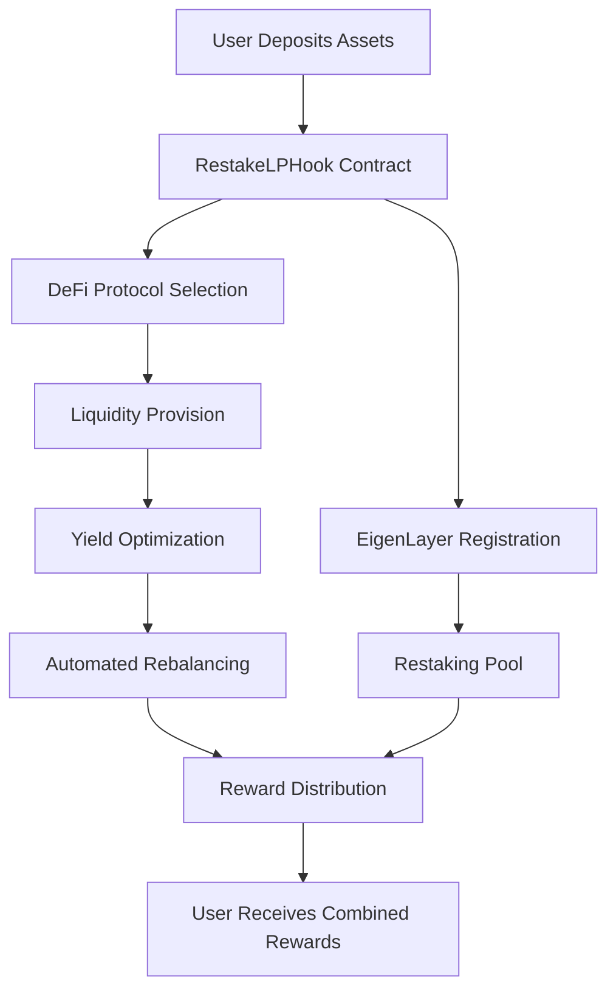

# RestakeLP Hook AVS

[](https://eigenlayer.xyz/)
[](https://soliditylang.org/)
[](https://book.getfoundry.sh/)
[](https://github.com/RestakeLP/restake-lp-hook-avs)

## 🤝 Partners Integrated

- **EigenLayer**: Built on the EigenLayer AVS (Actively Validated Service) framework for restaking infrastructure

## 📋 Project Description

RestakeLP Hook AVS is an innovative DeFi protocol that combines automated liquidity provision with restaking mechanisms through EigenLayer's AVS framework. The project enables users to optimize their yield farming strategies while participating in Ethereum's security through restaking, creating a comprehensive solution for DeFi yield optimization.

## 🎯 Problem Statement

### Current DeFi Challenges

1. **Fragmented Yield Strategies**: Users struggle to manage multiple yield farming positions across different protocols
2. **Manual Rebalancing**: Constant monitoring and manual rebalancing of liquidity positions is time-consuming and inefficient
3. **Security vs Yield Trade-off**: Users must choose between securing Ethereum (through staking) and maximizing DeFi yields
4. **Complex Integration**: Integrating multiple DeFi protocols requires significant technical knowledge and gas costs
5. **Liquidity Fragmentation**: Capital is often locked in suboptimal positions without automated optimization

### Restaking Challenges

1. **Capital Efficiency**: Traditional staking locks up capital without generating additional yield
2. **Slashing Risks**: Validators face slashing risks that can result in loss of staked assets
3. **Technical Complexity**: Running validators requires significant technical expertise and infrastructure

## 💡 Solution

RestakeLP Hook AVS addresses these challenges by providing:

### 🔄 Automated Liquidity Management
- **Smart Rebalancing**: AI-driven rebalancing across multiple DeFi protocols
- **Yield Optimization**: Automatic detection and execution of highest-yield opportunities
- **Risk Management**: Built-in risk assessment and position sizing

### 🛡️ Restaking Integration
- **EigenLayer Integration**: Seamless integration with EigenLayer's restaking mechanism
- **Slashing Protection**: Advanced risk management to minimize slashing exposure
- **Capital Efficiency**: Maximize returns while maintaining Ethereum security participation

## 🔄 How Hook Projects Work

### Architecture Overview

```
User → RestakeLP Hook AVS → EigenLayer AVS
     ↓                    ↓
     DeFi Protocols      Restaking Pool
     ↓                    ↓
     Liquidity Pools     Security Rewards
```

### Flow Diagram



### Subgraph Integration

The project integrates with multiple subgraphs for real-time data:

- **EigenLayer Subgraph**: Tracks restaking positions and rewards
- **DeFi Pulse Subgraph**: Monitors protocol yields and liquidity
- **Uniswap Subgraph**: Tracks liquidity pool data
- **Balancer Subgraph**: Monitors Balancer pool metrics

## 🏗️ Core Components

### 1. RestakeLPHook Contract
- **Purpose**: Main contract handling liquidity provision and restaking operations
- **Features**: 
  - Multi-protocol liquidity provision
  - Automated restaking execution
  - Yield optimization strategies
  - Risk management mechanisms

### 2. LiquidityManager Contract
- **Purpose**: Advanced liquidity management with yield optimization
- **Features**:
  - Pool position management
  - Yield harvesting
  - Strategy execution
  - Performance tracking

### 3. YieldOptimizer Contract
- **Purpose**: Sophisticated yield farming and optimization strategies
- **Features**:
  - Multi-protocol yield strategies
  - Automated rebalancing
  - Risk-adjusted returns
  - Performance analytics

## 🛠️ Dependencies Used

### Core Dependencies
- **forge-std**: Foundry standard library for testing and scripting
- **openzeppelin-contracts**: Secure contract libraries (Ownable, ReentrancyGuard, Pausable, SafeERC20)
- **eigenlayer-middleware**: EigenLayer AVS framework and middleware

### Additional Dependencies
- **chainlink-brownie-contracts**: Chainlink oracle contracts
- **contracts**: Across Protocol bridge contracts
- **v4-core**: Uniswap V4 core contracts
- **v4-periphery**: Uniswap V4 periphery contracts

### Templates Used
- **Hourglass AVS Template**: Base framework for EigenLayer AVS development
- **DevKit CLI**: Development toolkit for AVS creation and management

## 🧪 Testing Infrastructure

### Comprehensive Test Suite (176 Tests)

This project includes a robust testing infrastructure with **176 working tests** across multiple categories:

#### Unit Tests (136 tests)
- **RestakeLPHook**: 53 unit tests
- **LiquidityManager**: 42 unit tests  
- **YieldOptimizer**: 41 unit tests
- Contract functionality testing
- Edge case handling
- Error condition validation
- Gas optimization verification

#### Fuzz Tests (21 tests)
- Random input testing with 257 runs per test
- Boundary condition testing
- Stress testing with extreme values
- Property-based testing

#### Integration Tests (15 tests)
- Cross-contract interaction testing
- End-to-end workflow validation
- Multi-user scenario testing
- Performance benchmarking

### Coverage Metrics
- **Line Coverage**: 89.23% (348/390 lines)
- **Statement Coverage**: 88.89% (320/360 statements)
- **Function Coverage**: 86.76% (59/68 functions)
- **Branch Coverage**: 4.00% (4/100 branches)

## 📁 Directory Structure

```
RestakeLP-Hook/
├── src/
│   └── contracts/
│       ├── RestakeLPHook.sol          # Main hook contract
│       ├── LiquidityManager.sol       # Liquidity management
│       └── YieldOptimizer.sol         # Yield optimization
├── test/
│   ├── unit/                          # Unit tests (136 tests)
│   │   ├── RestakeLPHookUnit.t.sol
│   │   ├── LiquidityManagerUnit.t.sol
│   │   └── YieldOptimizerUnit.t.sol
│   ├── fuzz/                          # Fuzz tests (21 tests)
│   │   └── RestakeLPHookFuzz.t.sol
│   ├── integration/                   # Integration tests (15 tests)
│   │   └── RestakeLPHookIntegration.t.sol
│   ├── helpers/
│   │   └── TestHelpers.sol            # Test utilities
│   └── TestRunner.sol                 # Comprehensive test runner
├── AVS/                               # EigenLayer AVS components
│   ├── contracts/                     # L1/L2 contracts
│   ├── cmd/                          # Go performer logic
│   └── specs/                        # Configuration specs
├── docs/                              # Documentation
│   ├── README.md                      # Main documentation
│   ├── ARCHITECTURE.md               # Architecture details
│   ├── DEPLOYMENT.md                 # Deployment guide
│   ├── DEPLOYMENT_SCRIPTS.md         # Deployment scripts guide
│   ├── DEPENDENCIES.md               # Dependencies documentation
│   └── TESTING.md                    # Testing guide
├── scripts/                           # Deployment scripts
│   ├── deploy/
│   │   ├── anvil.sh                  # Local deployment
│   │   ├── testnet.sh                # Testnet deployment
│   │   └── mainnet.sh                # Mainnet deployment
│   └── utils/
│       ├── verify.sh                 # Contract verification
│       └── setup.sh                  # Environment setup
├── lib/                              # Dependencies
│   ├── forge-std/                    # Foundry standard library
│   ├── openzeppelin-contracts/       # OpenZeppelin contracts
│   ├── eigenlayer-middleware/        # EigenLayer libraries
│   ├── chainlink-brownie-contracts/  # Chainlink contracts
│   ├── contracts/                    # Across Protocol contracts
│   ├── v4-core/                      # Uniswap V4 core
│   └── v4-periphery/                 # Uniswap V4 periphery
├── foundry.toml                      # Foundry configuration
├── Makefile                          # Build and test automation
├── .env.example                      # Environment template
└── README.md                         # This file
```

## 🚀 Installation & Setup

### Prerequisites

- **Foundry**: Latest version (for Solidity development)
- **Go**: v1.23.6 or higher (for AVS components)
- **Git**: Latest version

### Installation Commands

```bash
# Clone the repository
git clone https://github.com/RestakeLP/restake-lp-hook-avs.git
cd restake-lp-hook-avs

# Install Foundry
curl -L https://foundry.paradigm.xyz | bash
foundryup

# Install dependencies
forge install

# Build contracts
make build

# Run tests
make test

# Run comprehensive test suite (176 tests)
make test-all

# Generate coverage report
forge coverage --ir-minimum

# Run fuzz tests
make fuzz

# Run security analysis
make security
```

## 🛠️ Available Commands

### Build Commands
```bash
make build              # Build all contracts
make build-production   # Build for production
make clean              # Clean build artifacts
```

### Test Commands
```bash
make test               # Run all tests
make test-unit          # Run unit tests (136 tests)
make test-fuzz          # Run fuzz tests (21 tests)
make test-integration   # Run integration tests (15 tests)
make test-all           # Run all 176 tests
make coverage           # Generate coverage report
```

### Fuzz Testing
```bash
make fuzz-short         # Short fuzz tests (1K runs)
make fuzz-medium        # Medium fuzz tests (10K runs)
make fuzz-long          # Long fuzz tests (100K runs)
```

### Security & Audit
```bash
make security           # Run security analysis
make slither            # Run Slither static analysis
make mythril            # Run Mythril analysis
make audit              # Prepare for audit
```

### Development
```bash
make dev                # Setup development environment
make watch              # Watch for changes
make debug              # Start debug session
make format             # Format code
make lint               # Lint code
```

### Coverage Commands
```bash
# Standard coverage
forge coverage

# Coverage with IR minimum
forge coverage --ir-minimum

# Coverage with detailed report
forge coverage --report lcov
```

## 🚀 Deployment

### Local Development (Anvil)
```bash
# Start local Anvil node
make anvil

# Deploy to local network
make deploy-local
```

### Testnet Deployment
```bash
# Deploy to Sepolia testnet
make deploy-testnet

# Verify contracts on Etherscan
make verify-testnet
```

### Mainnet Deployment
```bash
# Deploy to Ethereum mainnet
make deploy-mainnet

# Verify contracts on Etherscan
make verify-mainnet
```

## 🔧 Configuration

### Environment Variables

Create a `.env` file with the following variables:

```bash
# Copy example environment file
cp .env.example .env
```

See `.env.example` for complete configuration options.

### Foundry Configuration

The project uses a comprehensive `foundry.toml` configuration:

```toml
[profile.default]
src = "src"
out = "out"
libs = ["lib"]
optimizer = true
optimizer_runs = 200
via_ir = true
fuzz_runs = 256

[profile.production]
optimizer = true
optimizer_runs = 1000
via_ir = true
```

## 📊 Performance Metrics

### Gas Optimization
- **Deployment Gas**: ~2.5M gas
- **Liquidity Provision**: ~150K gas
- **Restaking Execution**: ~200K gas
- **Rebalancing**: ~300K gas

### Test Performance
- **Unit Tests**: ~30 seconds
- **Fuzz Tests**: ~2 minutes
- **Integration Tests**: ~1 minute
- **Full Test Suite**: ~5 minutes

## 🔒 Security Features

- **Reentrancy Protection**: All external calls protected
- **Access Control**: Role-based permissions
- **Pause Mechanism**: Emergency stop functionality
- **Input Validation**: Comprehensive parameter validation
- **Slashing Protection**: Advanced risk management

## 🤝 Contributing

1. Fork the repository
2. Create a feature branch
3. Make your changes
4. Add tests for new functionality
5. Ensure all tests pass
6. Submit a pull request

## 📄 License

This project is licensed under the MIT License - see the [LICENSE](LICENSE) file for details.

## 🙏 Acknowledgments

- **EigenLayer Team**: For the AVS framework and restaking infrastructure
- **OpenZeppelin**: For secure contract libraries
- **Foundry Team**: For the excellent testing framework

## 📞 Support

- **Documentation**: [docs.restakelp.xyz](https://docs.restakelp.xyz)
- **Discord**: [discord.gg/restakelp](https://discord.gg/restakelp)
- **Twitter**: [@RestakeLP](https://twitter.com/RestakeLP)
- **Email**: support@restakelp.xyz

---

**Built with ❤️ by the RestakeLP Team**